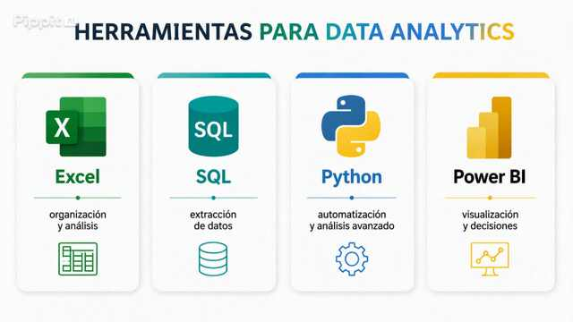

## Hi there

Soy Carlos Baztan, analista de datos. Este es mi espacio para compartir proyectos y mi aprendizaje continuo en Data Analytics.

### Herramientas que uso para Data Analytics

  

p>

- **Excel** - organizacion y analisis
- - **SQL** - extraccion de datos
  - - **Python** - automatizacion y analisis avanzado
    - - **Power BI** - visualizacion y toma de decisiones
     
      - ### Proyectos destacados
     
      - Puedes ver mis repositorios fijados mas abajo.
      - 
